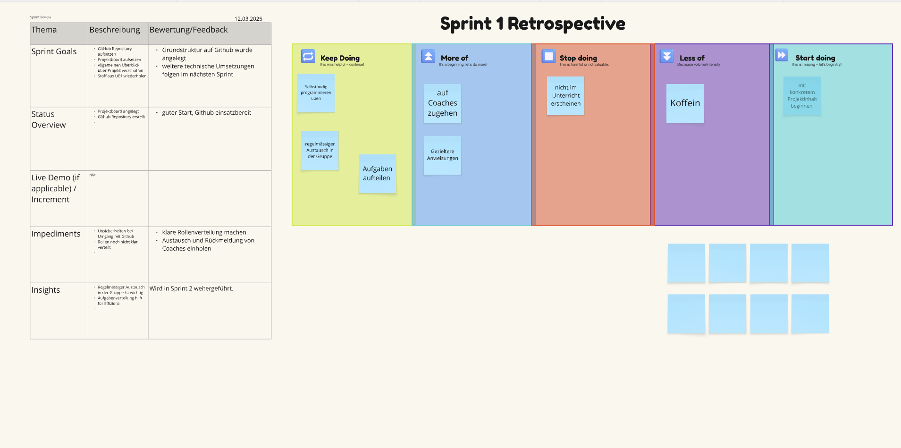
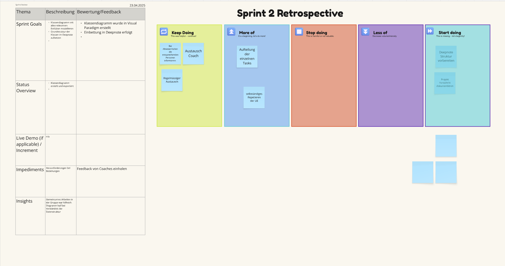
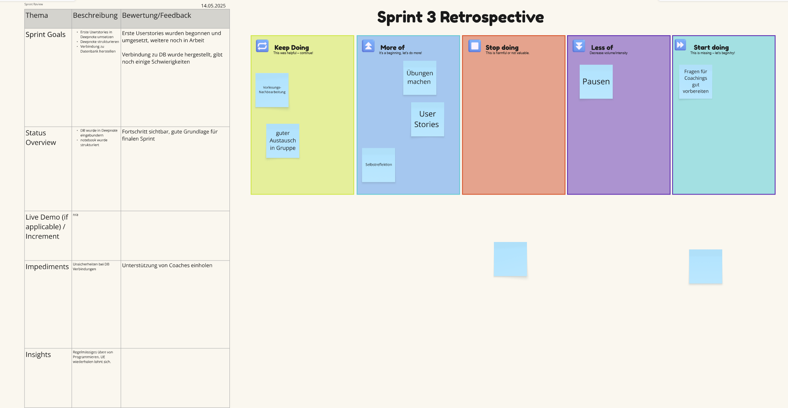

# Hotelreservation - Anwendungsentwicklung mit Python, FS25
Dieses Projekt wurde im Rahmen des Moduls „Anwendungsentwicklung mit Python“ im Frühlingssemester 2025 an der FHNW umgesetzt. Ziel war es, ein funktionales Hotelreservierungssystem zu entwickeln, welches Konzepte der Python-Programmierung abbildet. Darunter objektorientierte Programmierung, Datenbankzugriffe mit SQLite sowie die Umsetzung und Dokumentation der User Stories.
Die Arbeit erfolgte in einer vierköpfigen Projektgruppe. Neben der technischen Umsetzung stand auch das Arbeiten mit Entwicklungsumgebungen (Deepnote, GitHub) und die projektbezogene Zusammenarbeit im Fokus. Während dem Projekt wurden wir eng durch unsere Coaches begleitet. 

# 1. Autoren und Rollen im Projekt
| Name           | Rolle im Projekt                          |
|----------------|--------------------------------------------|
| Janis Oldani   | Implementierung User Stories in Business Logic, Umsetzung User Stories     |
| Dominik Bär    | Aufbau Klassenstruktur in Deepnote, Umsetzung User Stories  |
| Laurin Möck    | Setup und Pflege des Github-Repos, Umsetzung User Stories |
| Elena Pineider | Gesamtüberblick, Dokumentation README, Umsetzung User Stories |

# 2. Projektmanagement und Vorgehen
Das Projekt wurde in vier Sprints eingeteilt, welche an die Unterrichtseinheiten angepasst waren. Für die Umsetzung des Projekts haben wir eine Vorgehensweise in Anlehnung an Scrum gewählt. Der theoretisch vermittelte Unterrichtsstoff wurde jeweils direkt im Anschluss auf unser Projekt übertragen. Da eine neue Programmiersprache zu lernen viel Zeit und auch Geduld abverlangt, haben wir uns stark vorgenommen, dass die einzelnen Gruppenmitglieder das Programmieren jeweils im Selbststudium üben. So hatten wir vor Ort jeweils mehr Zeit für unser Projekt als Gruppe, wo Probleme und Schwierigkeiten gemeinsam diskutiert werden konnten. 

## 2.1 Tools und Technologien
Zur Umsetzung des gesamten Projekts wurden folgende Tools verwendet:
* Deepnote: Umsetzung und Dokumentation der User Stories
* Github: Versionskontrolle und overall Dokumentation des Projekts
* SQLite: Datenbank
* Modellierung: Visual Paradigm
* Miro Board: Sprint Planung

# 3. Klassendiagramm und Modellierung
In der Unterrichtseinheit 2 haben wir uns mit dem Object-Oriented-Programming (OOP) auseinander gesetzt. Wir haben gelernt, wie man aus einem ER-Diagramm (von den Coaches vorgegeben) ein Klassendiagramm nach den Prinzipien der objektorientierten Programmierung erstellt. Das ER-Diagramm beschreibt dabei die Datenstruktur des Hotelreservierungssystems. Es zeigt Entitäten wie "Hotel", "Room", "Guest", "Booking" usw. mit deren Attributen und Beziehungen. Basierend darauf haben wir unser Klassendiagramm erstellt. Jede Entität wurde dabei in eine Klasse übersetzt, ergänzt durch passende Methoden, um die OOP Prinzipien korrekt umzusetzen. 

## 3.1 Aufbau und Prinzipien unseres Klassendiagramms
Bei der Modellierung des Klassendiagramms haben wir folgende Konstrukte gelernt und angewendet: 
* **Encapsulation:** bezeichnet das Prinzip, dass interne Daten und die Implementierung einer Klasse privat bleiben und nur über definierte Schnittstellen (Getter, Setter) zugänglich sind. 
* **Private Attribute:** in unserem Klassendiagramm sind alle Attribute privat modelliert und mit einem Minuszeichen "-" gekennzeichnet. Im Python-Code beginnen diese mit zwei Unterstrichen (z.B. "__roomNo"). Dadurch wird der direktze Zugriff von aussen verhindert. Ein Benutzer der Klasse kann die DAten nicht unbeabsichtigt verändern.
* **Getter-Methode:** Diese Methode ermöglicht das kontrolierte Einsehen von Attributen. So kann ein Attribut zwar eingesehen aber nicht direkt verändert werden (z.B. "getRoomNo()").
* **Setter-Methode:** Diese Methode erlaubt es, den Wert eines privaten Attributes zu ändern (z.B. "setPricePerNight()").

Wir haben in unserem Klassendiagramm auf diese Methoden gesetzt, da es uns Schutz vor ungewollten Änderungen bringt und über die Setter und Getter ein klar definierter Zugriffspunkt entsteht. Die Setter ermöglichen es auch, bei Änderungen unter anderem Regeln zu prüfen (z.B. "stars" muss zwischen 1 und 5 liegen).

## 3.2 Die wichtigsten Klassen
| Klasse               | Beschreibung |
|----------------------|--------------|
| **Hotel**            | Enthält Name, Sternebewertung und eine Hotel-ID. Jedes `Hotel` ist einer `Address` zugeordnet und besteht aus mehreren `Room`-Objekten. |
| **Room**             | Enthält z. B. die Zimmernummer und den Preis pro Nacht. Ein `Room` ist einem `Hotel` zugeordnet und besitzt genau einen `RoomType`. |
| **RoomType**         | Gibt Auskunft über die Kapazität und Beschreibung eines Zimmers (z. B. Suite, Single). Dies erlaubt eine flexible Modellierung unterschiedlicher Zimmertypen. |
| **Facilities / RoomFacilities** | Hier wird eine m:n-Beziehung realisiert: Ein Zimmer kann mehrere Ausstattungsmerkmale (Facilities) haben, und dieselbe Ausstattung kann in mehreren Zimmern vorkommen. |
| **Guest**            | Enthält persönliche Informationen und ist mit mindestens einer `Booking` verknüpft. |
| **Booking**          | Verbindet `Guest` und `Room`, enthält Infos zu Datum, Stornierung und Gesamtbetrag. Eine `Booking` kann genau eine `Invoice` haben. |
| **Invoice**          | Enthält Ausstellungsdatum und Gesamtbetrag. Sie ist eindeutig einer Buchung zugeordnet. |
| **Address**          | Wird von `Hotel` und `Guest` verwendet, um Redundanz zu vermeiden (Wiederverwendbarkeit durch Aggregation). |

## 3.3 Fazit
Indem wir Attribute privat halten und den Zugriff über Methoden steuern, erhalten wir einen robusteren und wartbareren Code. Diese Architektur ist eine bewährte Praxis. 

# 

# 4. Main Learnings und Reflexion
In den folgenden beiden Abschnitten möchten wir unsere Main Learnings aufzeigen. Dabei unterscheiden wir unsere Learnings auf Teamzusammenarbeit und fachliche Kenntnisse. 
## 4.1 Team Zusammenarbeit
Während der Umsetzung des Projekts haben wir besonders viel über Effizienz als Team gelernt. Da jede Person unterschiedliche Stärken und Schwächen hat, mussten wir erst herausfinden, wie sich die Rollen innerhalb des Projekts zu verteilen haben. Dies war zu Beginn gar nicht so einfach, da wir uns noch nicht so gut gekannt haben. Von Beginn an war aber eine offene und transparebnte Kommunikation ein zentraler Wert von uns allen. Dieser Wert hat sich auch als sehr nützlich und hilfreich herausgestellt, da eine gute Teamarbeit nur durch einen regelmässigen Austausch funktionieren kann. 
Was haben wir konkret gelernt? 
* Aufgabenverteilung ist zentral: Durch die Aufteilung der Arbeit in kleine Einheiten (z. B. Datenmodellierung, Klassendiagramm, Implementierung der Klassen, Testen, Dokumentation) konnten wir parallel arbeiten und effizienter vorankommen
* Gemeinsames Verständnis schaffen: Besonders am Anfang war es wichtig, dass alle Teammitglieder ein Verständnis für das Datenmodell, die Userstories etc. haben, damit jeder die Schritte von den anderen Teammitgliedern nachvollziehen kann. Das war garnicht immer so einfach
* Communication is Key: Ein regelmässiger Austausch ist essenziell. So können Blockaden und Unsicherheiten schnell gelöst werden
* Coaching-Sessions gezielt nutzen: Durch das Vorbesprechen von allfälligen Fragen konnten wir die Coaching-Sessions gezielter nutzen, da gewisse Fragen schon im Vorhinein von einem Teammitglied geklärt werden konnten und wir mit den Coaches so die brennendsten Themen disskutieren konnten
## 4.2 Modul-bezogene Learnings
Neben der Teamarbeit konnten wir im Rahmen des Moduls konkrete fachliche und technische Kompetenzen aufbauen, die uns in den kommenden Modulen und hoffentlich in unserem späteren Arbeitsleben weiterbringen werden. 

### 4.2.1 Vom Datenmodell zum Klassendiagramm
* Wir haben gelernt, wie man vom ER-Diagramm in ein Klassendiagramm überführen kann
* Dabei haben wir gelernt, wie sich logische Entitäten (z.B. Hotel, Room, etc.) in Python-Klassen mit Beziehungen übersetzen lassen
* Zusätzlich konnten wir Konzepte aus unserem vorherigen Modul (Datenbasierte Unternehmensanwendungen) vertiefen, indem wir unser Wissen über zum Beispiel Beziehungen wie m:n mit Zwischentabellen anwenden konnten

### 4.2.2 Python und Objektorientierung
* Wir haben gelernt, wie man eigene Klassen mit Attributen, Methoden und Konstruktoren (__ init __) und Getter/Setter erstellt
* Durch den Einsatz von Entkapselung konnten wir den Zugriff auf Daten gezielt steuern und so wartbaren Code schreiben
* Wir haben den Nutzen von OOP-Konzepten wie z.B. Aggregation gelernt

### 4.2.3 Github
* Wir konnten in diesem Modul unsere ersten Erfahrungen mit Github machen, was uns in anderen Modulen auch weiterhalf
* Wir haben gelernt, wie man ein Repository erstellt, Dateien hochlädt und diese verwaltet
* Wir haben unser Projekt strukturiert abgelegt und begonnen, das read.ME als zentrale Dokumentation zu nutzen

### 4.2.4 Herausforderungen
* Der Einstieg in eine objektorientierte Denkweise ist uns am Anfang schwer gefallen. Insbesondere das saubere Trennen von Attributen und Methoden, sowie die Modellierung von Beziehungen
* Das richtige Umsetzen von Getter- und Setter-Methoden in Python war zu Beginn schwierig. Wir mussten das viel üben und rechechieren
* Der Umgang mit Github war zu Beginn sehr ungewohnt, da es für uns alle ein komplett neues Tool war. Wir mussten erst alle Funktionen und Möglichkeiten kennenlernen, bis wir wussten, was wir alles damit anfangen können
* Die Umsetzung von einzelnen User-Stories war teilweise schwierig, vorallem die Geschäftslogik korrekt zu interpretieren und in Code zu schreiben (z.B. wie Buchungen mit Rechnungen verknüpft werden sollen)

### 4.2.5 Lerneffekt
* Rückblickend konnten wir unser Verständnis für strukturierte Programmierung in Python deutlich erweitern
* Die iterative Umsetzung der User-Stories hat uns geholfen, die gelernte Theorie auf ein praktisches Beispiel anzuwenden
* Die von den Dozenten zu Beginn erwähnte Geduld, die es beim Lernen von Programmieren benötigt, hat sich ausbezahlt. Zu Beginn wirkte alles sehr abstrakt und durch viel Üben und direktes Umsetzen konnten wir uns einen Gesamt-Überblick über das gesamte Thema verschaffen

# 5. Anhang
## 5.1 Miro Board Sprints

