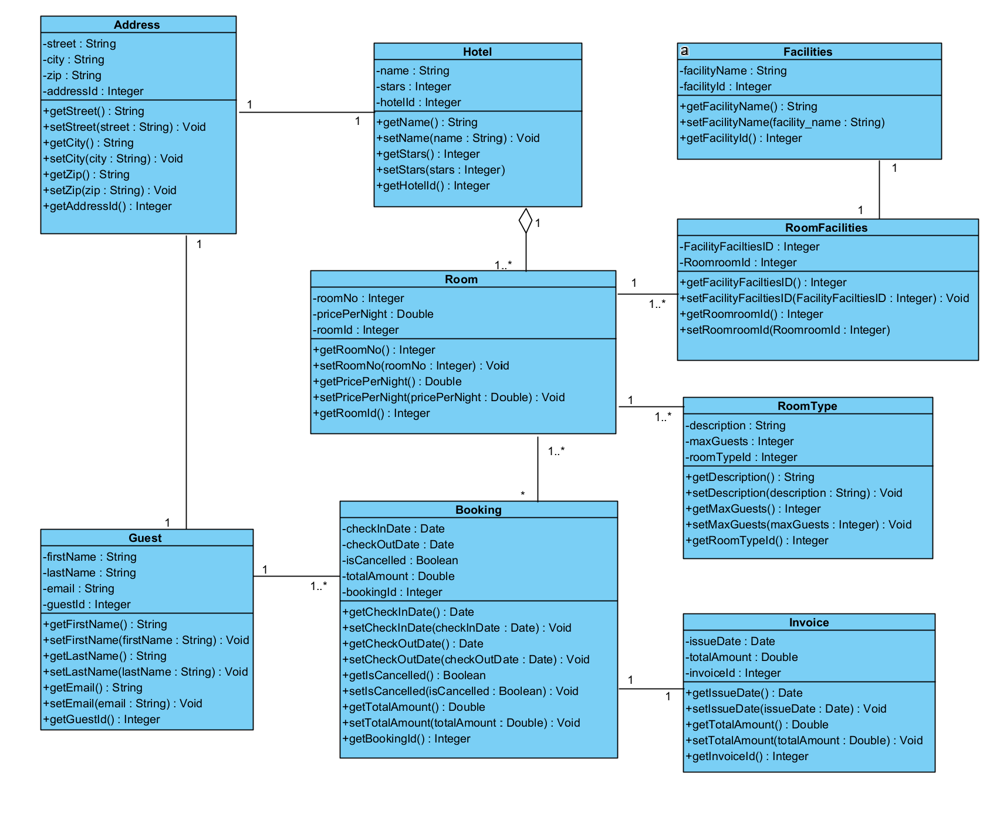

# Hotelreservation - Anwendungsentwicklung mit Python, FS25
Dieses Projekt wurde im Rahmen des Moduls „Anwendungsentwicklung mit Python“ im Frühlingssemester 2025 an der FHNW umgesetzt. Ziel war es, ein funktionales Hotelreservierungssystem zu entwickeln, welches Konzepte der Python-Programmierung abbildet. Darunter objektorientierte Programmierung, Datenbankzugriffe mit SQLite sowie die Umsetzung und Dokumentation der User Stories.
Die Arbeit erfolgte in einer vierköpfigen Projektgruppe. Neben der technischen Umsetzung stand auch das Arbeiten mit Entwicklungsumgebungen (Deepnote, GitHub) und die projektbezogene Zusammenarbeit im Fokus. Während dem Projekt wurden wir eng durch unsere Coaches begleitet. 

# Autoren und Rollen im Projekt
| Name           | Rolle im Projekt                          |
|----------------|--------------------------------------------|
| Janis Oldani   | Implementierung User Stories in Business Logic, Umsetzung User Stories     |
| Dominik Bär    | Aufbau Klassenstruktur in Deepnote, Umsetzung User Stories  |
| Laurin Möck    | Setup und Pflege des Github-Repos, Umsetzung User Stories |
| Elena Pineider | Gesamtüberblick, Dokumentation README, Umsetzung User Stories |

# Projektmanagement und Vorgehen
Das Projekt wurde in vier Sprints eingeteilt, welche an die Unterrichtseinheiten angpasst waren. Für die Umsetzung des Projekts haben wir eine Vorgehensweise in Anlehnung an Scrum gewählt. Der theoretisch vermittelte Unterrichtsstoff wurde jeweils direkt im Anschluss auf unser Projekt übertragen. Da eine neue Programmiersprache zu lernen viel Zeit und auch Geduld abverlangt, haben wir uns stark vorgenommen, dass die einzelnen Gruppenmitglieder das Programmieren jeweils im Selbststudium üben. So hatten wir vor Ort jeweils mehr Zeit für unser Projekt als Gruppe, wo Probleme und Schwierigkeiten gemeinsam disskutiert werden konnten. 

## Tools und Technologien
Zur Umsetzung des gesamten Projekts wurden folgende Tools verwendet:
* Deepnote: Umsetzung und Dokumentation der User Stories
* Github: Versionskontrolle und overall Dokumentation des Projekts
* SQLite: Datenbank
* Modellierung: Visual Paradigm
* Miro Board: Sprint Planung

# Klassendiagramm und Modellierung
In der Unterrichtseinheit 2 haben wir uns mit dem Object-Oriented-Programming (OOP) auseinander gesetzt. Wir haben gelernt, wie man aus einem ER-Diagramm (von den Coaches vorgegeben) ein Klassendiagramm nach den Prinzipien der objektorientierten Programmierung erstellt. Das ER-Diagramm beschreibt dabei die Datenstruktur des Hotelreservierungssystems. Es zeigt Entitäten wie "Hotel", "Room", "Guest", "Booking" usw. mit deren Attributen und Beziehungen. Basierend darauf haben wir unser Klassendiagramm erstellt. Jede Entität wurde dabei in eine Klasse übersetzt, ergänzt durch passende Methoden, um die OOP Prinzipien korrekt umzusetzen. 

## Aufbau und Prinzipien unseres Klassendiagramms
Bei der Modellierung des Klassendiagramms haben wir folgende Konstrukte gelernt und angewendet: 
* **Encapsulation:** bezeichnet das Prinzip, dass interne Daten und die Implementierung einer Klasse privat bleiben und nur über definierte Schnittstellen (Getter, Setter) zugänglich sind. 
* **Private Attribute:** in unserem Klassendiagramm sind alle Attribute privat modelliert und mit einem Minuszeichen "-" gekennzeichnet. Im Python-Code beginnen diese mit zwei Unterstrichen (z.B. "__roomNo"). Dadurch wird der direktze Zugriff von aussen verhindert. Ein Benutzer der Klasse kann die DAten nicht unbeabsichtigt verändern.
* **Getter-Methode:** Diese Methode ermöglicht das kontrolierte Einsehen von Attributen. So kann ein Attribut zwar eingesehen aber nicht direkt verändert werden (z.B. "getRoomNo()").
* **Setter-Methode:** Diese Methode erlaubt es, den Wert eines privaten Attributes zu ändern (z.B. "setPricePerNight()").

Wir haben in unserem Klassendiagramm auf diese Methoden gesetzt, da es uns Schutz vor ungewollten Änderungen bringt und über die Setter und Getter ein klar definierter Zugriffspunkt entsteht. Die Setter ermöglichen es auch, bei Änderungen unter anderem Regeln zu prüfen (z.B. "stars" muss zwischen 1 und 5 liegen).

## Die wichtigsten Klassen
| Klasse               | Beschreibung |
|----------------------|--------------|
| **Hotel**            | Enthält Name, Sternebewertung und eine Hotel-ID. Jedes `Hotel` ist einer `Address` zugeordnet und besteht aus mehreren `Room`-Objekten. |
| **Room**             | Enthält z. B. die Zimmernummer und den Preis pro Nacht. Ein `Room` ist einem `Hotel` zugeordnet und besitzt genau einen `RoomType`. |
| **RoomType**         | Gibt Auskunft über die Kapazität und Beschreibung eines Zimmers (z. B. Suite, Single). Dies erlaubt eine flexible Modellierung unterschiedlicher Zimmertypen. |
| **Facilities / RoomFacilities** | Hier wird eine m:n-Beziehung realisiert: Ein Zimmer kann mehrere Ausstattungsmerkmale (Facilities) haben, und dieselbe Ausstattung kann in mehreren Zimmern vorkommen. |
| **Guest**            | Enthält persönliche Informationen und ist mit mindestens einer `Booking` verknüpft. |
| **Booking**          | Verbindet `Guest` und `Room`, enthält Infos zu Datum, Stornierung und Gesamtbetrag. Eine `Booking` kann genau eine `Invoice` haben. |
| **Invoice**          | Enthält Ausstellungsdatum und Gesamtbetrag. Sie ist eindeutig einer Buchung zugeordnet. |
| **Address**          | Wird von `Hotel` und `Guest` verwendet, um Redundanz zu vermeiden (Wiederverwendbarkeit durch Aggregation). |

## Fazit
Indem wir Attribute privat halten und den Zugriff über Methoden steuern, erhalten wir einen robusteren und wartbareren Code. Diese Architektur ist eine bewährte Praxis. 

# 

# Main Learnings und Reflexion

## Team Zusammenarbeit

## Modul-bezogene Learnings

# Anhang
## Miro Board Sprints

